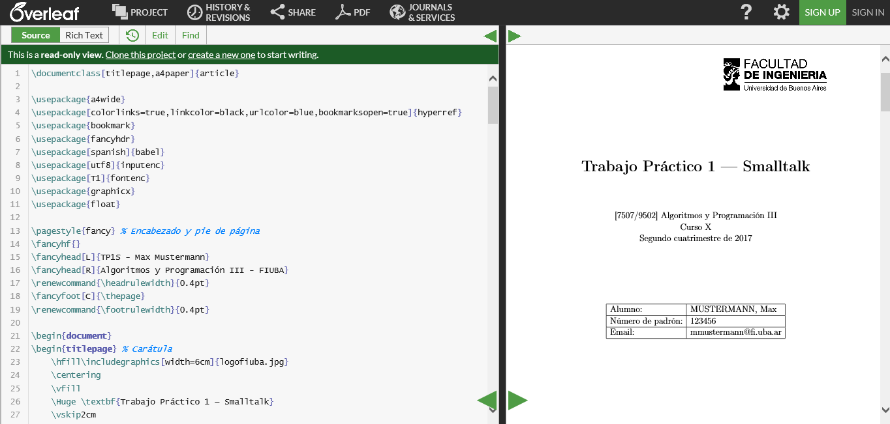

# Plantilla para informe de trabajos prácticos

Si no están familiarizados con [LaTeX](https://es.wikipedia.org/wiki/LaTeX) pueden crearse una cuenta en [Overleaf](https://www.overleaf.com/project) y utilizar esta [plantilla](https://www.overleaf.com/latex/templates/plantilla-de-trabajos-practicos-para-algoritmos-y-programacion-iii-fiuba/cvxtmcnxtxbw#.Ws-3XYjwZoY) a modo de ejemplo.

En el panel izquierdo se ubica el código que pueden modificar con sus datos personales y el contenido de su trabajo. A la derecha aparece la previsualización del informe. Para subir imágenes se debe hacer click en el botón "PROJECT" y aparecerá la estructura a la izquierda. Una vez finalizada la edición se puede crear un archivo pdf mediante el botón "PDF".
No es obligatorio usar Overleaf ni LaTeX, es simplemente una sugerencia. El informe sí deberá ser un archivo pdf con la carátula y las secciones como se pide en el enunciado pero pueden utilizar su editor de textos preferido.

